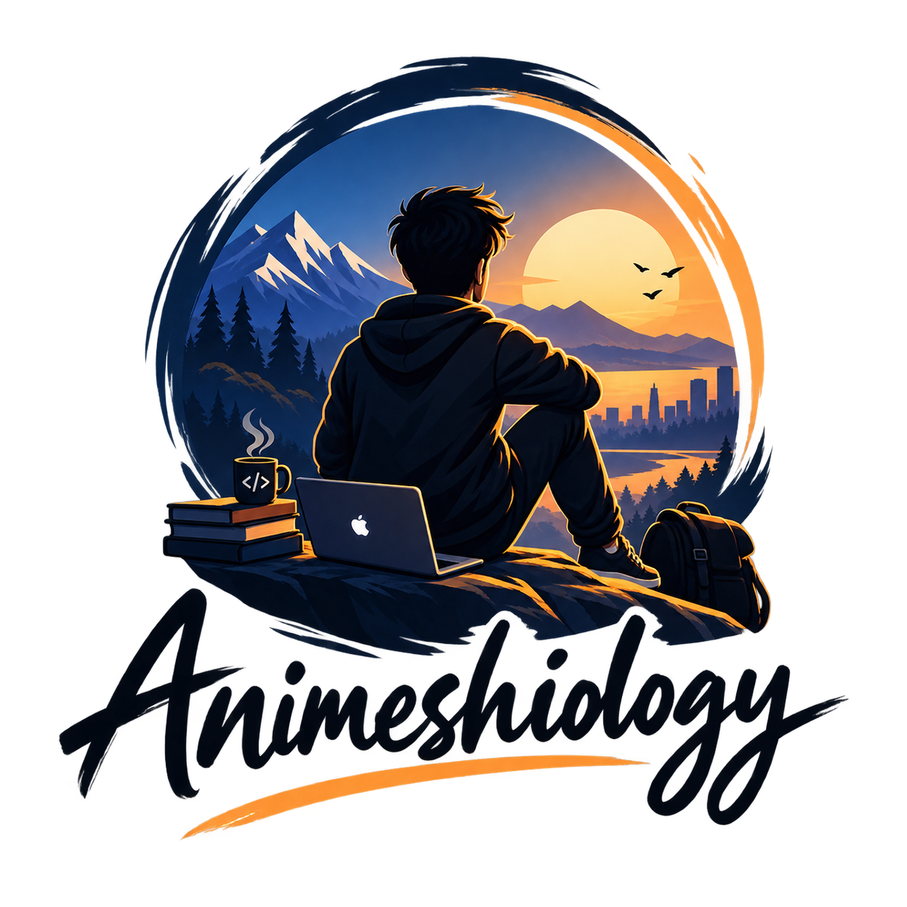

  

<h3 align="center">Hi, I'm Animesh</h3>

I design and ship AI agent systems: multi-agent orchestration, LLM tool-calling pipelines, and the retrieval infrastructure underneath them. My open-source work spans DSPy program optimization, LangChain/LangGraph agent graphs, and vector database tooling. Everything I publish is tested against real, running infrastructure before it ships, not mocks.

  
  

<strong>Languages</strong>

  
  

<strong>AI / Agents</strong>

  
  
  
  

<strong>Frontend / Backend</strong>

  
  
  

<strong>Cloud / Infra / Data</strong>

  
  
  
  

---

### Featured Projects

**[vecparity](https://github.com/ANIMESHIOLOGY/vecparity)**: live, quality-verified migration between vector databases. Migrates incrementally with no downtime and produces a pass/fail parity report (recall@k, result overlap, score drift) before you cut over. Six backends supported: pgvector, Qdrant, Pinecone, Milvus, Weaviate, Chroma.
 

**[promptvc](https://github.com/ANIMESHIOLOGY/prompt-version-control)**: git for your prompts. Version, diff, and roll back LLM prompts with zero infrastructure, just a local SQLite file. Ships with a VS Code extension.
 

**[dspy-langchain-bridge](https://github.com/ANIMESHIOLOGY/dspy-langchain-bridge)**: a compatibility bridge between DSPy and LangChain. Use DSPy's prompt optimizers inside a LangChain pipeline, or LangChain's retrievers and tools inside a DSPy module.

---

  

